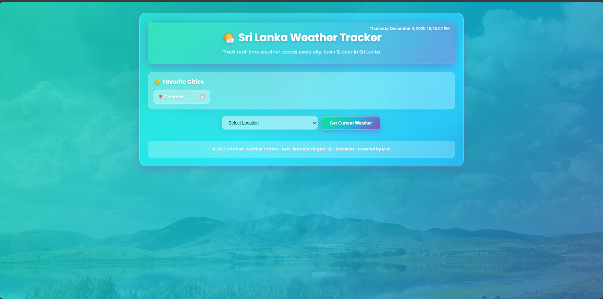

# 🌤️ Sri Lanka Weather Hub

<div align="center">

*A beautiful and realistic weather application for Sri Lankan districts*

**Built with ❤️ by Reezma Hanan**

[](https://php.net/)
[](https://javascript.com/)
[](https://css3.com/)
[](https://mysql.com/)
[](https://apachefriends.org/)

[](https://github.com/reezmahanan/Weather-App/stargazers)
[](https://github.com/reezmahanan/Weather-App/network/members)
[](https://github.com/reezmahanan/Weather-App/issues)
[](LICENSE)

</div>

---

Table of Contents
- About
- Screenshots
- Features
- Technology Stack
- Quick Start
- Usage
- Customization
- Contributing
- License
- Author

## About
Sri Lanka Weather Hub is a self-contained, realistic mock weather application covering all 25 Sri Lankan districts. It simulates weather changes over time without requiring external APIs and is designed for local development (XAMPP).

## Screenshots
(Place your images in a `screenshots/` directory using the filenames below; placeholders are shown.)

- Main Dashboard  
  

- All Districts View  
  

- Mobile Responsive  
  

- Single District Weather  
  

## Features
- Realistic weather simulation that updates over time
- Coverage of all 25 Sri Lankan districts
- Regional weather patterns (Coastal, Hill Country, Dry Zone)
- Smooth animations, glassmorphism cards and particle background
- Population & area data per district with basic weather analytics
- Auto database setup on first run (creates DB + tables + seed data)
- No external API dependencies

## Technology Stack
- PHP 7.4+
- MySQL / MariaDB
- JavaScript (ES6+)
- CSS3 (Grid, Flexbox, animations)
- HTML5
- XAMPP (recommended for local dev)

## Quick Start

Prerequisites
- XAMPP with PHP 7.4+ and MySQL/MariaDB
- Recommended MySQL port: 3307 (project configured for this port by default)

Install & Run
1. Copy project to your XAMPP htdocs folder, e.g.:
   - C:/xampp/htdocs/Weather-App
2. Start Apache and MySQL using XAMPP Control Panel.
3. Visit the app in your browser:
   - http://localhost/Weather-App/

Notes
- On first run the app will automatically create the database, tables and populate the 25 districts with initial realistic weather data.
- If your MySQL uses a different port or credentials, update the database configuration in the project config file (check database connection settings in the code).

## Usage

Single District
- Select a district from the dropdown to view detailed weather, population and area data.

All Districts
- Choose "All Sri Lankan Districts" to view a table comparison of current weather and stats across districts.

Regional Patterns
- Coastal: Warmer, more humid (e.g., Colombo, Galle)
- Hill Country: Cooler, misty (e.g., Kandy, Nuwara Eliya)
- Dry Zone: Hotter, drier (e.g., Anuradhapura)

## Customization

Change Theme Colors
- Edit CSS variables in your stylesheet (e.g., style.css):
```css
:root {
  --primary-blue: #4FC3F7;
  --primary-green: #4DB6AC;
  /* change these values to modify the theme */
}
```

Add / Modify Districts
- Edit the district seed array in index.php (or the dedicated seeder file) to add or update district entries.

Database Config
- Update DB host, port, user and password in the project's DB config file if your environment differs from the defaults.

## Contributing
We welcome contributions! To contribute:
1. Fork the repository
2. Create a feature branch: git checkout -b feature/YourFeature
3. Commit changes: git commit -m "Add: YourFeature"
4. Push: git push origin feature/YourFeature
5. Open a Pull Request describing your changes

Report bugs or request features by opening issues on the repository.

## License
This project is licensed under the MIT License. See the LICENSE file for details.

## Author
Reezma Hanan  
GitHub: @reezmahanan  
Project: https://github.com/reezmahanan/Weather-App

---

Made with ❤️ by Reezma Hanan — If you find this project useful, please give it a ⭐!
