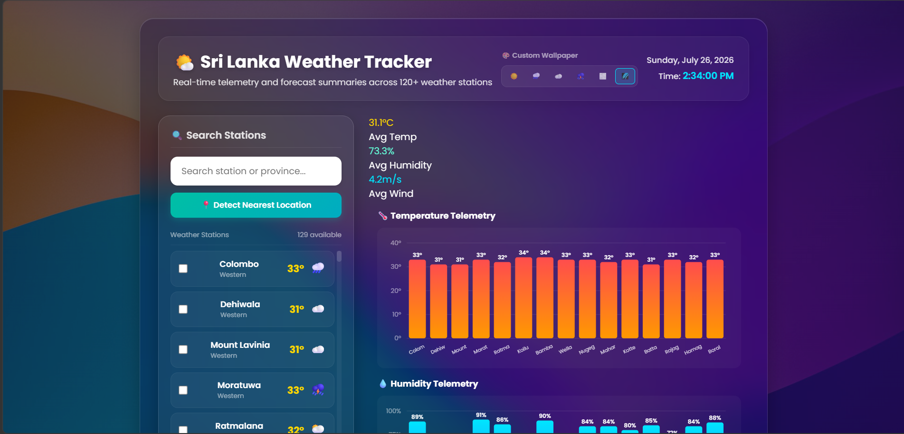

# Sri Lanka Weather Tracker 🌤️

A premium, full-screen responsive web dashboard providing real-time weather telemetry and 7-day forecasting for over 120 locations across all 9 provinces of Sri Lanka. Built with React and Vite.



---

## 🚀 Key Features

* **📡 Live Real-Time Telemetry**: Connects directly to the keyless **Open-Meteo API** to fetch current temperature, apparent temperature, relative humidity, wind speed, WMO codes, and weather advisories for selected stations.
* **📅 7-Day Forecasting**: Parses and renders a 7-day horizontal scroll deck with temperature ranges and condition emojis.
* **📈 Interactive SVG Analytics**: Generates custom SVG trend graphs mapping Min/Max/Avg temperature curves dynamically. Includes SVG bar charts comparing conditions across top locations.
* **🔍 Search & Filter Grid**: Quickly search and filter all 120+ weather stations. Includes a **Geolocation Finder** to automatically select the nearest station inside Sri Lanka.
* **⭐ Favorite Bookmarks**: Bookmark favorite stations. Current conditions are loaded as live widget cards directly in the sidebar panel.
* **📊 Multi-City Comparison Deck**: Select 2+ locations and compare them side-by-side in a horizontal comparison deck, highlighting the warmest location with a glowing border.
* **📄 PDF Consolidated Reports**: Export and download formatted telemetry reports (single-station detailed sheets or consolidated all-locations summaries) via `jsPDF`.
* **🎨 Customizable Wallpaper**: Choose from 6 high-fidelity background wallpapers (Sunny, Rainy, Cloudy, Storm, Foggy, Slate) that persist across page reloads.
* **⚙️ Seeded Offline Simulator**: Utilizes a deterministic LCG (Linear Congruential Generator) weather simulator to populate data instantly on boot or as a reliable offline fallback.

---

## 🛠️ Technology Stack

1. **Frontend Core**: React 19 (Hooks, Context, Memoized state updates)
2. **Build Tool & Server**: Vite 8
3. **Styling**: Vanilla CSS (Fluid flexbox/grids, glassmorphic card templates)
4. **PDF Exports**: `jspdf` (Custom-drawn tables and layout sheets)

---

## 📂 Project Structure

```
Weather-App/
├── src/
│   ├── components/
│   │   ├── AnalyticsDashboard.jsx  # National stats, SVG bar charts, location table
│   │   ├── ComparisonTable.jsx    # Side-by-side horizontal compare deck
│   │   ├── FavoritesList.jsx      # Bookmark cards listed in sidebar
│   │   └── ForecastSection.jsx     # Hero weather details, warnings, SVG line trend graph
│   ├── data/
│   │   └── locations.js            # District coordinates, populations, land areas for 120+ cities
│   ├── utils/
│   │   ├── exporter.js             # jsPDF formatting scripts
│   │   ├── geo.js                  # Haversine distance coords calculations
│   │   └── weatherEngine.js        # API fetches, seeded random generator, WMO mappers
│   ├── App.jsx                     # Dashboard controller managing state
│   ├── index.css                   # Responsive styles, grid systems, custom variables
│   └── main.jsx                    # Vite React app mount point
├── index.html                      # App layout shell
├── package.json                    # Dependencies and run scripts
├── vercel.json                     # Vercel URL routing configuration
└── vite.config.js                  # Vite configuration
```

---

## 🚀 Running Locally

### Prerequisites
* [Node.js](https://nodejs.org/) (v18 or higher recommended)
* npm (comes bundled with Node)

### Installation
Clone the repository and install the dependencies:
```bash
npm install
```

### Running Development Server
Run the local development server with hot-reload listening on port `5173`:
```bash
npm run dev
```
Open [http://localhost:5173/](http://localhost:5173/) in your web browser.

### Compiling Production Build
Build and optimize the application assets for production distribution:
```bash
npm run build
```
The compiled files will be output to the `/dist` directory.

---

